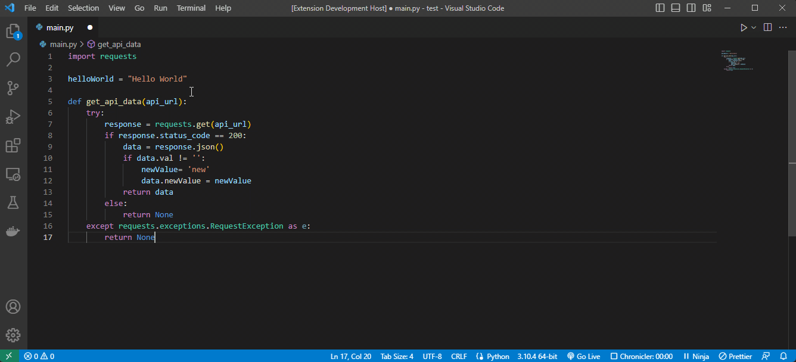

# Lazy Logger

No more writing **print()** in python manually. This is a Python extension to adding logs after selecting an variable with a shortcut key **ctrl + alt + a**.

## Features
- Add a print statement for a variable in a file in next line .
- Show file name.
- Show line number of the variable.

## Usage
Select a variable and press **ctrl + alt + a**. Output will show like below on the next line.

## Requirements
Files with .py extension.

## Known Issues

Partially support for Javascript, Typescript, C#, Java and Rust

## Release Notes

Adding print statements on the next line after selecting a variable in Python
Print statement will have the file name and the line number of the variable you are trying to log and the variable name.

### 0.1.3

Initial release of master-logger with support to Python.

